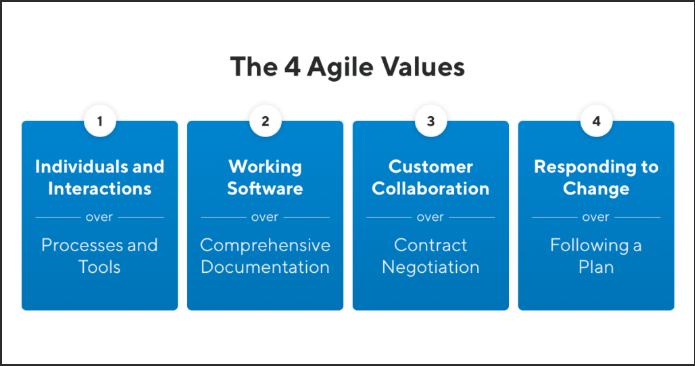

## What is the Agile Manifesto?

The Agile Manifesto is a brief document built on 4 values and 12 principles for agile software development. The Agile Manifesto was published in February 2001 and is the work of 17 software development practitioners who observed the increasing need for an alternative to documentation-driven and heavyweight software development processes.

## What is the History of the Agile Manifesto?
In February 2001, 17 software development practitioners gathered at a ski resort in Utah. They were there to ski. They were there to relax. And, they were there to eat and drink. But most importantly, they were there to lament, pontificate, and solve problems.

Despite having widely varying opinions on the right way to approach software development, the crew agreed on at least one thing: the status quo was not working. There was an increasing need for an alternative to documentation-driven and heavyweight software development processes.

The group named themselves “The Agile Alliance.” Out of their gathering in Utah that winter came The Agile Manifesto, a brief document built on 4 values and 12 principles for agile software development.

It’s important to note that agile in itself wasn’t born then. Before this, its creators and many other software development practitioners had long been applying various agile values and principles piecemeal. But The Agile Manifesto made concrete the ideas that had been permeating the software development world for the last decade or so.

## Who Created the Agile Manifesto?
As stated above, software practitioners from various backgrounds gathered to form the Agile Alliance who created The Agile Manifesto. But who exactly were they? Here’s who signed the original Agile Manifesto back in 2001:

- Kent Beck, who co-created eXtreme Programming (XP).
- Mike Beedle, co-author of Agile Software Development with Scrum.
- Arie van Bennekum, owner of Integrated Agile.
- Alistair Cockburn, IT strategist and creator of the Crystal Agile Methodology.
- Ward Cunningham, inventor of wiki and first to coin term technical debt.
- Martin Fowler, software practitioner, and partner at Thoughtworks.
- James Grenning, author of Test-Driven Development.
- Jim Highsmith, creator of Adaptive Software Development (ASD).
- Andrew Hunt, co-author of The Pragmatic Programmer.
- Ron Jeffries, co-creator of eXtreme Programming (XP).
- Jon Kern who still helps organizations with agile today.
- Brian Marick, a computer scientist and author of several books on programming.
- Robert C. Martin, also known as “Uncle Bob,” who consults via Clean Coding
- Steve Mellor, a computer scientist also credited with inventing Object-Oriented System Analysis (OOSA).
- Ken Schwaber, who co-created Scrum with Jeff Sutherland.
- Jeff Sutherland, the inventor, and co-creator of Scrum.
- Dave Thomas, programmer, and co-author of The Pragmatic Programmer

## What does The Agile Manifesto Say?
The Agile Manifesto outlines a set of 4 values and 12 principles for agile software development.

## The 4 Agile Values
The agile mentality has 4 overarching values differentiating it from traditional software development processes.

## The 12 Agile Principles
In addition to its 4 values, The Agile Manifesto also outlines 12 principles for agile development practices. These 12 principles emphasize things like “early and continuous delivery of valuable software” and “continuous attention to technical excellence.” Ready for more?

## Agile is a Mentality
While the 12 agile principles and 4 values for agile provide useful guidance for those hoping to practice agile software development, they are not prescriptive.

The Agile Manifesto does not outline any specific processes, procedures, or best practices for agile. And that is intentional. The creators did not set out to develop a rigid framework or methodology. Instead, they created a philosophical mindset for software development.

## References

* https://www.productplan.com/glossary/agile-manifesto/
