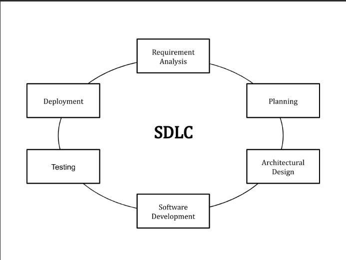

## Understand the Software Development Life Cycle

The Software Development Life Cycle (SDLC) refers to a methodology with clearly defined processes for creating high-quality software. in detail, the SDLC methodology focuses on the following phases of software development:

- Requirement analysis
- Planning
- Software design such as architectural design
- Software development
- Testing
- Deployment

## What is the software development life cycle?

SDLC or the Software Development Life Cycle is a process that produces software with the highest quality and lowest cost in the shortest time possible. SDLC provides a well-structured flow of phases that help an organization to quickly produce high-quality software which is well-tested and ready for production use.

The SDLC involves six phases as explained in the introduction. Popular SDLC models include the waterfall model, spiral model, and Agile model.

So, how does the Software Development Life Cycle work?

## How the SDLC Works

SDLC works by lowering the cost of software development while simultaneously improving quality and shortening production time. SDLC achieves these apparently divergent goals by following a plan that removes the typical pitfalls of software development projects. That plan starts by evaluating existing systems for deficiencies.

Next, it defines the requirements of the new system. It then creates the software through the stages of analysis, planning, design, development, testing, and deployment. By anticipating costly mistakes like failing to ask the end-user or client for feedback, SLDC can eliminate redundant rework and after-the-fact fixes.

It’s also important to know that there is a strong focus on the testing phase. As the SDLC is a repetitive methodology, you have to ensure code quality at every cycle. Many organizations tend to spend few efforts on testing while a stronger focus on testing can save them a lot of rework, time, and money. Be smart and write the right types of tests.

Next, let’s explore the different stages of the Software Development Life Cycle.

## Stages and Best Practices

Following the best practices and/or stages of SDLC ensures the process works in a smooth, efficient, and productive way.

#### 1. Identify the Current Problems
“What are the current problems?” This stage of the SDLC means getting input from all stakeholders, including customers, salespeople, industry experts, and programmers. Learn the strengths and weaknesses of the current system with improvement as the goal.

#### 2. Plan
“What do we want?” In this stage of the SDLC, the team determines the cost and resources required for implementing the analyzed requirements. It also details the risks involved and provides sub-plans for softening those risks.

In other words, the team should determine the feasibility of the project and how they can implement the project successfully with the lowest risk in mind.

#### 3. Design
“How will we get what we want?” This phase of the SDLC starts by turning the software specifications into a design plan called the Design Specification. All stakeholders then review this plan and offer feedback and suggestions. It’s crucial to have a plan for collecting and incorporating stakeholder input into this document. Failure at this stage will almost certainly result in cost overruns at best and the total collapse of the project at worst.

#### 4. Build
“Let’s create what we want.”

At this stage, the actual development starts. It’s important that every developer sticks to the agreed blueprint. Also, make sure you have proper guidelines in place about the code style and practices.

For example, define a nomenclature for files or define a variable naming style such as camelCase. This will help your team to produce organized and consistent code that is easier to understand but also to test during the next phase.

#### 5. Code Test
“Did we get what we want?” In this stage, we test for defects and deficiencies. We fix those issues until the product meets the original specifications.

In short, we want to verify if the code meets the defined requirements.

#### 6. Software Deployment
“Let’s start using what we got.”

At this stage, the goal is to deploy the software to the production environment so users can start using the product. However, many organizations choose to move the product through different deployment environments such as a testing or staging environment.

This allows any stakeholders to safely play with the product before releasing it to the market. Besides, this allows any final mistakes to be caught before releasing the product.

#### Extra: Software Maintenance
“Let’s get this closer to what we want.” The plan almost never turns out perfect when it meets reality. Further, as conditions in the real world change, we need to update and advance the software to match.

The DevOps movement has changed the SDLC in some ways. Developers are now responsible for more and more steps of the entire development process. We also see the value of shifting left. When development and Ops teams use the same toolset to track performance and pin down defects from inception to the retirement of an application, this provides a common language and faster handoffs between teams.

Application performance monitoring (APM) tools can be used in a development, QA, and production environment. This keeps everyone using the same toolset across the entire development lifecycle.

## Examples

The most common SDLC examples or SDLC models are listed below.

### Waterfall Model
This SDLC model is the oldest and most straightforward. With this methodology, we finish one phase and then start the next. Each phase has its own mini-plan and each phase “waterfalls” into the next. The biggest drawback of this model is that small details left incomplete can hold up the entire process.

### Agile Model
The Agile SDLC model separates the product into cycles and delivers a working product very quickly. This methodology produces a succession of releases. Testing of each release feeds back info that’s incorporated into the next version. According to Robert Half, the drawback of this model is that the heavy emphasis on customer interaction can lead the project in the wrong direction in some cases.

### Iterative Model
This SDLC model emphasizes repetition. Developers create a version very quickly and for relatively little cost, then test and improve it through rapid and successive versions. One big disadvantage here is that it can eat up resources fast if left unchecked.

### V-Shaped Model
An extension of the waterfall model, this SDLC methodology tests at each stage of development. As with waterfall, this process can run into roadblocks.

### Big Bang Model
This high-risk SDLC model throws most of its resources at development and works best for small projects. It lacks the thorough requirements definition stage of the other methods.

### Spiral Model
The most flexible of the SDLC models, the spiral model is similar to the iterative model in its emphasis on repetition. The spiral model goes through the planning, design, build and test phases over and over, with gradual improvements at each pass.

### Benefits of the SDLC
SDLC done right can allow the highest level of management control and documentation. Developers understand what they should build and why. All parties agree on the goal upfront and see a clear plan for arriving at that goal. Everyone understands the costs and resources required.

Several pitfalls can turn an SDLC implementation into more of a roadblock to development than a tool that helps us. Failure to take into account the needs of customers and all users and stakeholders can result in a poor understanding of the system requirements at the outset. The benefits of SDLC only exist if the plan is followed faithfully.

Want to improve application quality and monitor application performance at every stage of the SDLC? Try out Stackify’s Retrace tool for free and experience how it can help your organization at producing higher-quality software.

## References
* https://stackify.com/what-is-sdlc/
